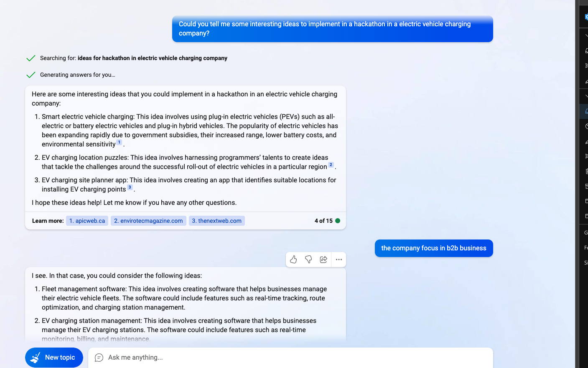
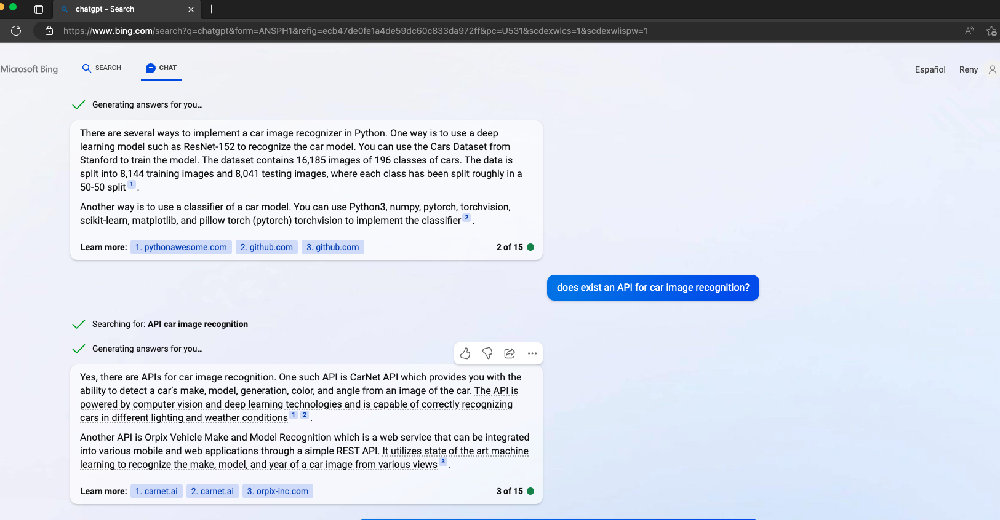
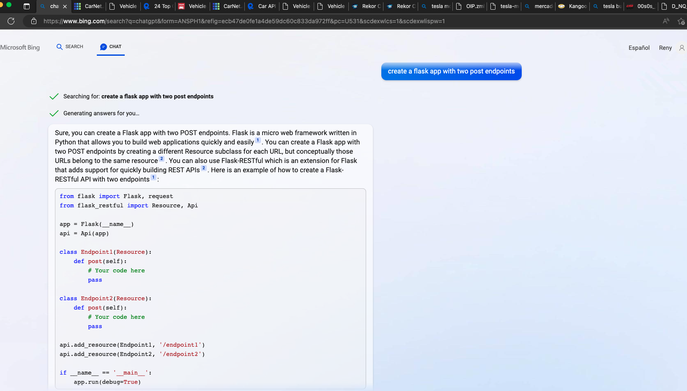
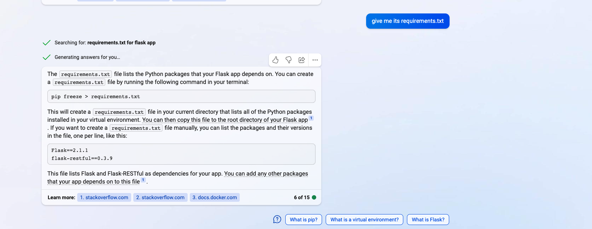

# Using AI to generate this project

## Getting ideas
We asked ChatGPT to generate ideas for us. But most of them were impossible to implement in a single day.

## Filter Ideas
After that we realize that one important problem for the mobile app users is to set the default setting based on their vehicles. So we decided to focus on that problem.

## Generate the project
* We asked ChatGPT to provide us some API that could identify the vehicle model based on a picture. We got this:

* After that we asked ChatGPT to generate the template for the project: a web app with only two endpoints.

* But we need the dependencies for this project so we requested ChatGPT to generate the dependencies:

* Once we got the template we started to code using the Copilot plugin in PyCharm with and we copy the code generated by Postman and we changed it using Copilot in order to made it more generic:

* We also used the Copilot plugin to generate the Dockerfile and the docker-compose.yml:
  

## Final thoughts
* It seems easier to implement new code than to refactor existing code using this tools.
* Sometimes the can give you code that is not working.
* They work like a template system on steroids.

